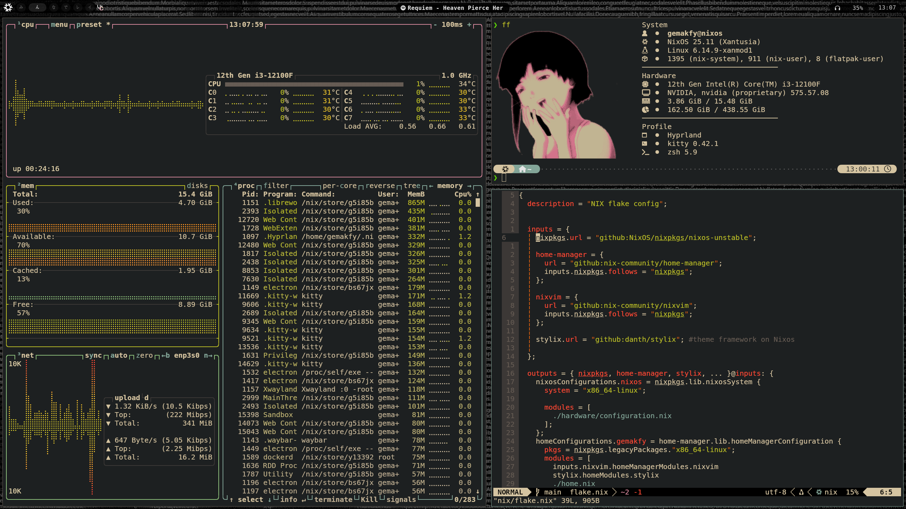
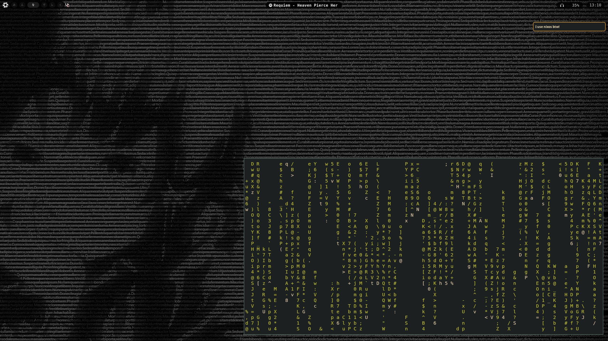

# ❄  NixOS Gruvbox Rice

Gruvbox theme for NixOS with Hyprland.

## 🖼️ Screenshots






| Software       | Description                                  |
|-----------------|-------------------------------------------|
| [Hyprland](https://github.com/hyprwm/hyprland) 🪟 | Wayland compositor            |
| [Rofi](https://github.com/davatorium/rofi)🚀 | Launcher, clipboard and emoji  |
| [Kitty](https://github.com/kovidgoyal/kitty)🐱 | Terminal                   |
| [Waybar](https://github.com/Alexays/Waybar) | Panel for Wayland        |
| [Dunst](https://github.com/dunst-project/dunst)🔔 | Notification Daemon             |
| [Yazi](https://github.com/sxyazi/yazi)📂 | File Manager|
| [Xanmod](https://xanmod.org/)⚡ | Linux Kernel              |

# 🛠️ Installation
```
nix-shell -p git
git clone https://github.com/gemakfy/NixOS-dotfiles
cd ./NixOS-dotfiles/hardware
rm hardware-configuration.nix
cp /etc/nixos/hardware-configuration.nix .
sudo nixos-rebuild switch --flake .
home-manager switch --flake .
reboot
```

> **⚠️ Warning**
> This configuration is specifically designed for username `gemakfy`.
> If your username is different, the config will not work without modifications.
> replace all occurrences of `gemakfy` with your username.

## 🥀references
config base: https://github.com/Andrey0189/nixos-config
waybar: https://github.com/V3ntus/nixos
